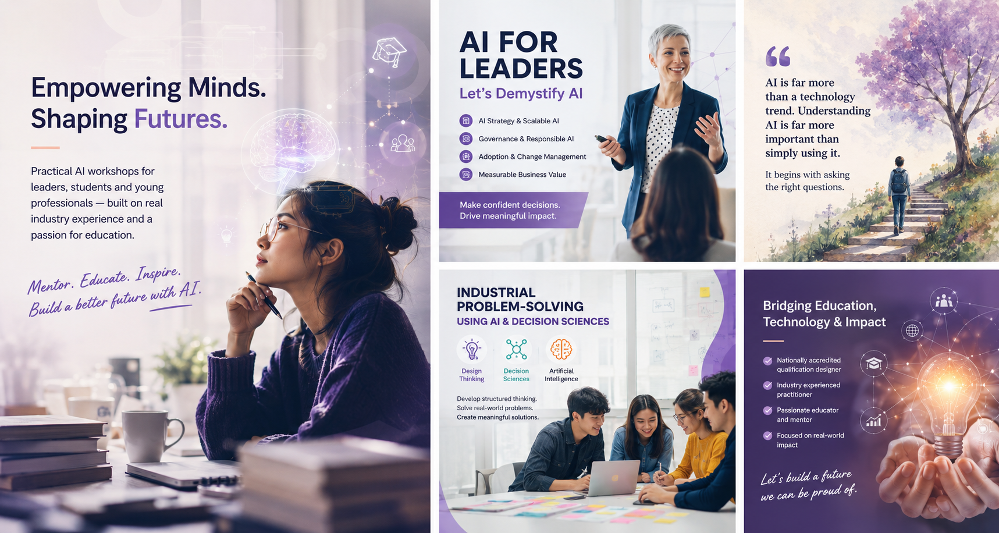

  

# About the Educator

Education and mentoring have always been at the heart of this work — long before AI
became a household word, and long after the hype of any particular tool fades away.

---

## A Career Shaped by Curiosity and Teaching

The path here did not begin with a job title. It began with a persistent question:
*how do you help people understand something genuinely complex without losing the
depth that makes it worthwhile?*

That question has driven everything — from early work in industry, through academia,
and into the design of educational programmes that have shaped thousands of learners.

Writing, teaching and sharing knowledge have always been just as fulfilling as
building technology. The two are not in tension; they are the same practice, viewed
from different angles.

---

## Nationally Accredited Qualifications in Data Science

At a time when "Data Science" was not yet a common phrase, nationally accredited
qualifications in the discipline were designed and delivered from the ground up.

This involved:

- Defining what practitioners at every level genuinely need to know
- Structuring content so that foundational concepts lead naturally to applied skills
- Ensuring graduates could think clearly under uncertainty — not just execute a workflow
- Collaborating with industry partners to keep programmes relevant and grounded

The result was a qualification that produced graduates who could reason about data,
not just process it.

---

## Mentoring Across Academia and Industry

Mentoring is not a side activity. It is the work itself.

Over the years, students and professionals across both academia and industry have
received guidance at moments that mattered: a career pivot, a difficult technical
decision, a project that was not going as expected, or simply a conversation about
what to do next.

!!! quote "A guiding principle"
    The best mentoring does not give people answers. It gives them better questions.

---

## Spanning Both Worlds

A career that moves between academia and industry creates an unusual vantage point.
Academic rigour matters. So does the practical wisdom that only comes from working
inside real organisations facing real constraints.

These workshops exist because of that dual perspective. They are not textbook
summaries of AI, and they are not vendor-sponsored overviews of the latest platform.
They are grounded in what actually works, what organisations actually struggle with,
and what students actually need to compete in a world shaped by AI.

---

## Writing and Knowledge Sharing

Alongside teaching and mentoring, writing has been a consistent thread — technical
writing, curriculum design, accessible explanations of difficult ideas, and public
talks at events that range from industry conferences to university forums.

Sharing knowledge publicly is a commitment, not a marketing strategy.

---

  
  <a href="../ai-for-leaders/" class="chapter-nav__next">Next: AI for Leaders →</a>

