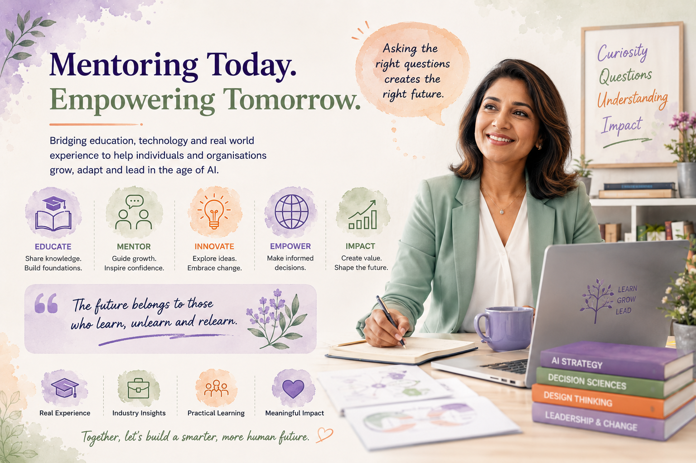

  

# Approach

These workshops are not lectures. They are not product demonstrations. They are
not a series of slides with AI buzzwords on them.

They are structured learning experiences, built on years of teaching, mentoring and
working inside real organisations — designed to help people think more clearly and
act more effectively.

---

## Practical Rather Than Theoretical

Every concept introduced in these workshops is connected to a real scenario,
a genuine decision or an actual challenge that organisations and individuals face.

Abstract theory has its place. But workshops for leaders and students work best when
the learning is grounded in something that feels real — because it is.

!!! info "Experience over abstraction"
    These workshops draw on experience designing nationally accredited qualifications,
    mentoring professionals across industry, and working at the intersection of
    academia and applied technology.

---

## Based on Real Industry Experience

The content of these workshops is not sourced from textbooks or vendor documentation.
It comes from years of working with organisations across sectors, observing what
actually works, what fails in practice, and what questions people do not know to ask
until things go wrong.

That experience shapes everything: the examples used, the problems explored, the
risks highlighted and the frameworks applied.

---

## Interactive and Discussion-Led

Participants are active contributors to their own learning — not passive recipients
of information.

Every session includes opportunities for:

- Discussion and debate
- Collaborative problem-solving
- Challenging assumptions — including the facilitator's
- Applying frameworks to real scenarios
- Sharing experience and perspective from within the room

The facilitator asks more questions than they answer.

---

## Inclusive and Accessible

Good education should not require people to already know the answer before they
can engage with the material.

These workshops are designed to be accessible to participants who are new to AI,
to data science and to formal problem-solving methods. No jargon is used without
explanation. No assumption is made that participants have a technical background.

At the same time, the content is substantive enough to engage participants who do
have technical backgrounds — because the skills being developed go beyond any
single discipline.

---

## Adaptable to Different Audiences

The same core ideas are relevant to a board-level executive and to a high school
student — but the framing, examples and activities need to be different.

Before every engagement, a brief discovery conversation ensures the workshop is
designed around the specific audience: their background, their current level of
understanding, their challenges and their goals.

The result is a session that feels tailored, not generic.

---

## Focused on Understanding, Not Product Promotion

These workshops have no commercial relationship with any AI vendor, platform or
tool provider. No particular product is promoted. No affiliate arrangement
influences the content.

The goal is to develop understanding that is durable across whatever tools exist
today and whatever tools will exist in the future.

---

## Designed to Create Lasting Capability

The measure of a good workshop is not what participants say at the end. It is what
they are able to do differently three months later.

These workshops aim to leave participants with:

- Frameworks they can apply to new situations
- Questions they know how to ask
- Confidence to engage with AI — and AI vendors — on their own terms
- A habit of thinking clearly before acting quickly

That is the kind of capability worth building.

---

  <a href="../industrial-problem-solving/" class="chapter-nav__prev">← Industrial Problem-Solving</a>
  <a href="../book-a-workshop/" class="chapter-nav__next">Next: Book a Workshop →</a>

