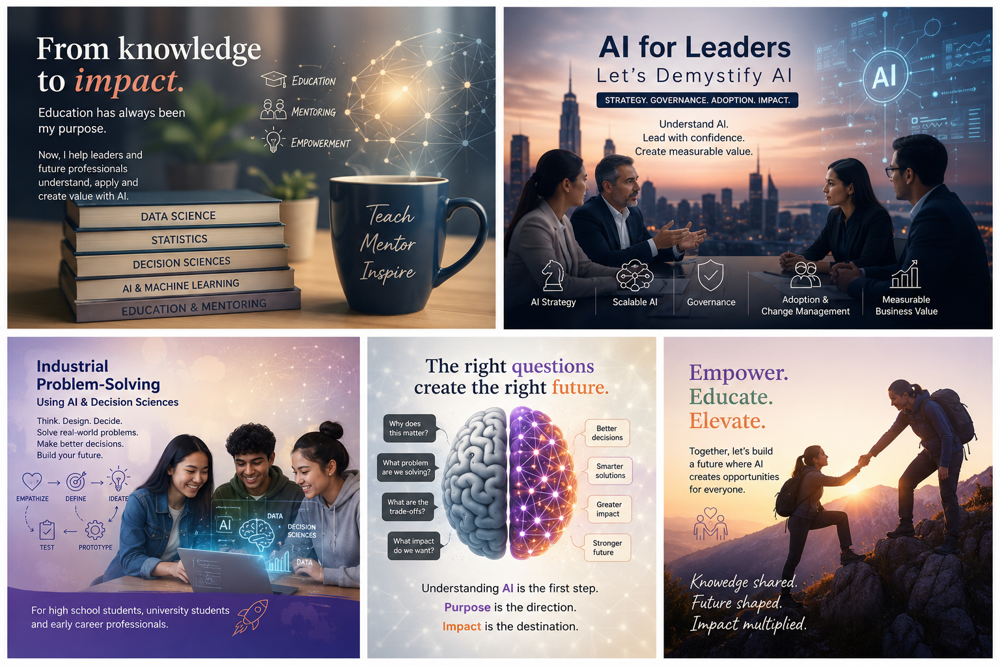
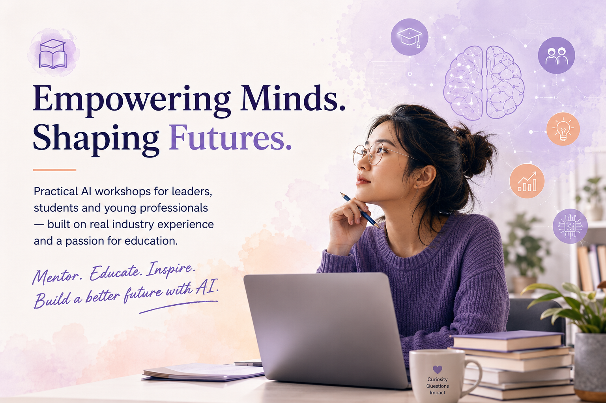
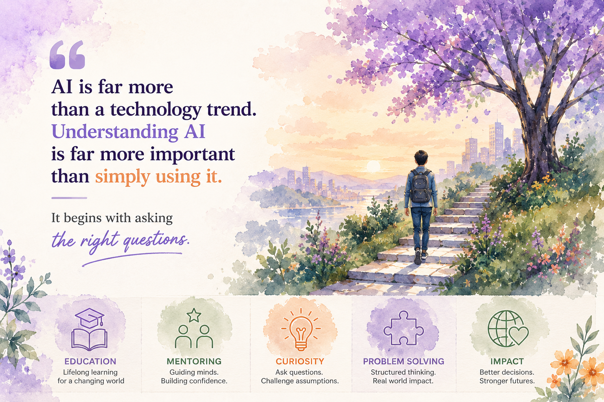

  
Education · Mentoring · Artificial Intelligence

  <h1 class="hero-heading">Understand AI. Ask Better Questions. Create Real Impact.</h1>
  

    Practical workshops for leaders, students and young professionals —
    built on real industry experience and a passion for education.
  

  

    <a href="#workshops" class="btn btn-primary">Explore the Workshops</a>
    <a href="book-a-workshop/" class="btn btn-secondary">Book a Workshop</a>
  

<section id="workshops" class="chapter-grid-section" aria-label="Workshop chapters">
  

    <a class="chapter-card" href="about/" aria-label="About the Educator – Introduction">
      

        
      

      

        Introduction
        <h2 class="chapter-card__title">About the Educator</h2>
        

          A career built around education, mentoring, Data Science and
          practical technology.
        

        Explore chapter →
      

    </a>

    <a class="chapter-card" href="ai-for-leaders/" aria-label="AI for Leaders – For Leaders workshop">
      

        
      

      

        For Leaders
        <h2 class="chapter-card__title">AI for Leaders</h2>
        

          Demystify AI strategy, governance, adoption, change and
          measurable business value.
        

        Explore chapter →
      

    </a>

    <a class="chapter-card" href="philosophy/" aria-label="Understanding AI – Philosophy chapter">
      

        
      

      

        Philosophy
        <h2 class="chapter-card__title">Understanding AI</h2>
        

          Why understanding AI and asking better questions matter more
          than chasing the latest tools.
        

        Explore chapter →
      

    </a>

    <a class="chapter-card" href="industrial-problem-solving/" aria-label="Industrial Problem-Solving – For Students & Young Professionals">
      

        
      

      

        For Students &amp; Young Professionals
        <h2 class="chapter-card__title">Industrial Problem-Solving</h2>
        

          Use Design Thinking, Decision Sciences and AI to solve
          meaningful real-world problems.
        

        Explore chapter →
      

    </a>

    <a class="chapter-card" href="approach/" aria-label="Mentoring Today – Approach chapter">
      

        
      

      

        Approach
        <h2 class="chapter-card__title">Mentoring Today</h2>
        

          Bridging education, technology and industry experience to help
          people grow and lead.
        

        Explore chapter →
      

    </a>

    <a class="chapter-card" href="book-a-workshop/" aria-label="Book a Workshop – Get Started">
      

        
      

      

        Get Started
        <h2 class="chapter-card__title">Book a Workshop</h2>
        

          Bring a practical, tailored AI workshop to your organisation
          or educational institution.
        

        Explore chapter →
      

    </a>

  

</section>
