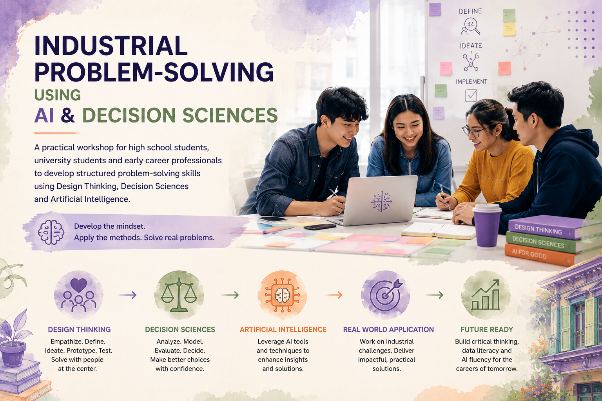

  

# Industrial Problem-Solving Using AI &amp; Decision Sciences

The world does not need more people who can use AI tools. It needs people who can
define the right problem, question their assumptions, evaluate trade-offs and
communicate their reasoning clearly — then choose the right tools to help.

This workshop builds those skills.

---

## Who This Workshop Is For

=== "High School Students"

    Students in senior secondary school who are curious about how the technology
    they encounter every day actually works — and how it is used to solve genuine
    industrial challenges. No prior technical knowledge required.

=== "University Students"

    Undergraduate and postgraduate students across engineering, science, business,
    mathematics and related disciplines who want to develop structured
    problem-solving skills that complement their academic training.

=== "Early-Career Professionals"

    Graduates and professionals in the first few years of their careers who want
    to build confidence in applying systematic thinking and AI appropriately
    in workplace settings.

---

## Why Structured Problem-Solving Matters

Most real-world problems are poorly defined. The challenge is rarely "solve this";
it is usually "figure out what the actual problem is, and then work out whether
it is worth solving and how."

AI tools can contribute enormously to this process — but only after the problem
has been properly understood. Applied too early, to a poorly defined problem,
AI produces outputs that are fast and confident but ultimately wrong.

Structured problem-solving is the missing ingredient. This workshop teaches it
explicitly, using methods and frameworks that work in real settings.

---

## Design Thinking

Design Thinking is a human-centred approach to problem-solving that begins with
understanding the people affected by a problem before reaching for a solution.

The key stages covered in the workshop:

1. **Empathise** — understand the context, the people involved and what they actually need
2. **Define** — articulate the problem clearly, avoiding the trap of solving the wrong thing
3. **Ideate** — generate a range of possible approaches before committing to one
4. **Prototype** — create quick, low-cost ways to test ideas before scaling them
5. **Test** — gather real feedback and refine the approach

!!! tip "A common trap"
    Skipping directly from "problem" to "solution" is the most common mistake in
    applied problem-solving. Design Thinking structures the journey to avoid it.

---

## Decision Sciences

Decision Sciences provides the analytical framework for evaluating options under
uncertainty — which is the condition under which most real decisions are made.

Topics covered:

- Structuring decisions so that options can be compared fairly
- Identifying what information matters and what does not
- Understanding risk, probability and trade-offs
- Using data to inform decisions — not to replace judgement
- Recognising cognitive biases that distort decisions and how to account for them

---

## Artificial Intelligence

AI is introduced as a tool within a structured problem-solving process — not as
an end in itself.

Participants explore:

- What kinds of problems AI is genuinely suited to
- What kinds of problems AI handles poorly or dangerously
- How to interpret AI outputs critically rather than accepting them at face value
- How AI and human judgement work best together
- The ethical dimensions of applying AI to real problems

---

## Real-World Industrial Challenges

The workshop uses real industrial scenarios drawn from sectors that matter:
engineering, healthcare, logistics, infrastructure, energy and others.

These challenges are:

- Complex enough to require structured thinking
- Open-ended enough to reward creativity
- Grounded enough in reality to feel genuinely important

Working through real challenges is more effective than studying abstract examples.
Participants leave knowing what it feels like to apply these methods to something
that matters.

---

## Team-Based Activities

Most of the workshop is hands-on and team-based. Groups work together to:

- Analyse a problem and agree on what is actually being asked
- Challenge each other's assumptions
- Evaluate competing approaches
- Make a reasoned recommendation they can defend

Team dynamics, communication and constructive disagreement are all part of the
learning experience.

---

## Expected Outcomes

By the end of the workshop, participants will be able to:

!!! success "Skills you will develop"

    - **Define the correct problem** — before reaching for a solution
    - **Challenge assumptions** — including their own
    - **Evaluate trade-offs** — with limited information and under time pressure
    - **Use data more thoughtfully** — as evidence, not as authority
    - **Apply AI appropriately** — matching the tool to the problem, not the problem to the tool
    - **Communicate recommendations** — clearly and persuasively to different audiences
    - **Build confidence** — in their own reasoning and judgement
    - **Career readiness** — with a framework that works across roles and industries

---

## Delivery Options

| Format | Duration | Best for |
|--------|----------|----------|
| Conference session | 60–90 minutes | Inspiration and introduction |
| Half-day workshop | 3–4 hours | Core methods with one applied challenge |
| Full-day workshop | 6–7 hours | Full process with multiple challenges |
| Custom programme | Multiple sessions | Integrated curriculum or bootcamp |

The workshop can be delivered to school groups, university cohorts, graduate
programmes or early-career professional teams.

---

  <h2 class="cta-panel__heading">Bring this workshop to your students or team</h2>
  

    Whether you are a school, a university, a graduate programme or an organisation
    developing early-career talent, this workshop can be tailored to your context.
  

  <a href="../book-a-workshop/" class="btn btn-primary">Book This Workshop</a>

---

  <a href="../philosophy/" class="chapter-nav__prev">← Understanding AI</a>
  <a href="../approach/" class="chapter-nav__next">Next: Approach →</a>

